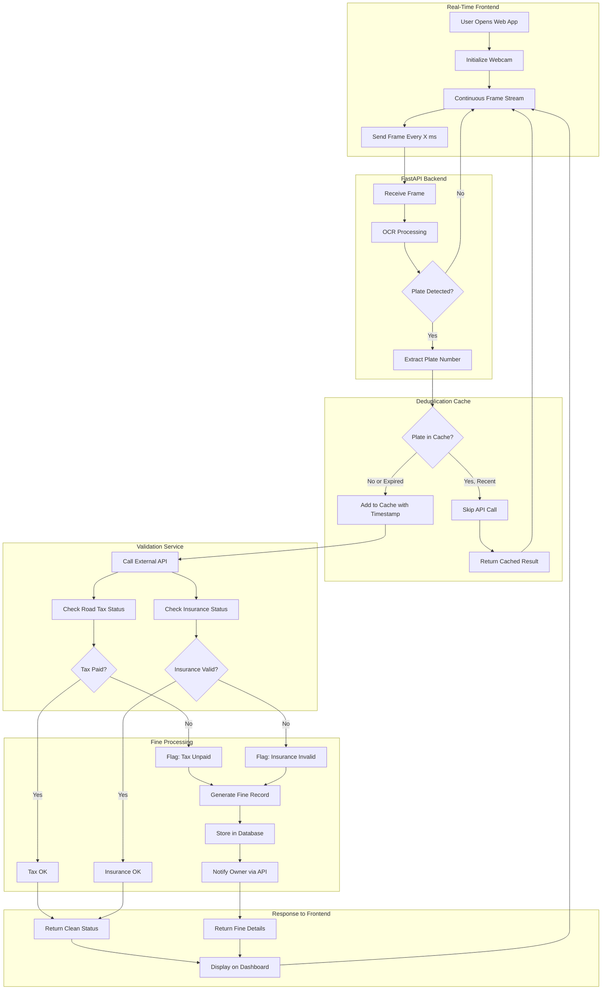
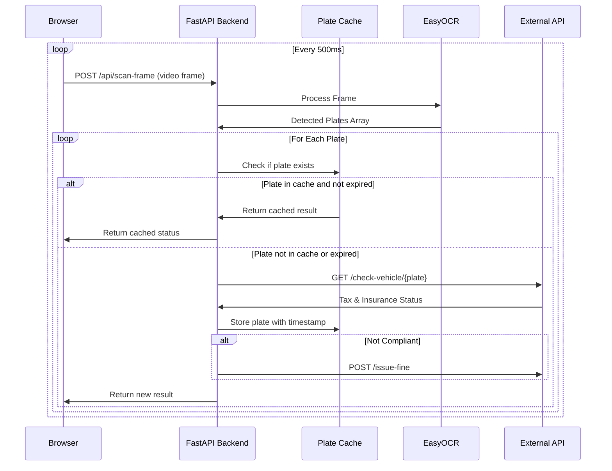

# Void Tax System - Design Plan

## Key Features
- **Real-time scanning**: Continuous webcam frame processing
- **Deduplication**: Cache prevents duplicate API calls for recently scanned plates
- **FastAPI backend**: Async support for high-performance real-time processing

## System Flow Diagram



## Real-Time Scanning Sequence



## Project Structure

```
void-tax/
├── app/
│   ├── __init__.py
│   ├── main.py               # FastAPI app entry point
│   ├── config.py             # Settings with Pydantic
│   ├── routers/
│   │   ├── __init__.py
│   │   ├── scan.py           # Real-time scanning endpoints
│   │   └── fines.py          # Fine management endpoints
│   ├── services/
│   │   ├── __init__.py
│   │   ├── ocr_service.py    # EasyOCR integration
│   │   ├── plate_cache.py    # Deduplication cache
│   │   ├── validation_api.py # External API client (httpx async)
│   │   └── fine_service.py   # Fine processing
│   ├── models/
│   │   ├── __init__.py
│   │   ├── schemas.py        # Pydantic request/response models
│   │   └── database.py       # SQLAlchemy models
│   └── utils/
│       └── image_processor.py
├── static/
│   ├── css/
│   │   └── styles.css
│   └── js/
│       └── realtime-scanner.js
├── templates/
│   └── index.html
├── requirements.txt
└── run.py
```

## Key API Endpoints

| Method | Endpoint | Description |
|--------|----------|-------------|
| GET | `/` | Serve web dashboard |
| POST | `/api/scan-frame` | Process single video frame |
| GET | `/api/fines` | List all issued fines |
| GET | `/api/cache/stats` | View cache statistics |
| GET | `/docs` | Auto-generated API docs (Swagger) |

## FastAPI Advantages for This Project

1. **Async Support**: Non-blocking calls to external validation API
2. **High Performance**: Handle rapid frame submissions efficiently
3. **Auto Documentation**: Built-in Swagger UI at `/docs`
4. **Pydantic Models**: Type-safe request/response validation
5. **Easy Testing**: Built-in test client

## Core Code Structure

### Main FastAPI App
```python
# app/main.py
from fastapi import FastAPI
from fastapi.staticfiles import StaticFiles
from fastapi.templating import Jinja2Templates
from app.routers import scan, fines

app = FastAPI(title="Void Tax System")
app.mount("/static", StaticFiles(directory="static"))
app.include_router(scan.router, prefix="/api")
app.include_router(fines.router, prefix="/api")
```

### Async Scan Endpoint
```python
# app/routers/scan.py
@router.post("/scan-frame")
async def scan_frame(file: UploadFile):
    plates = await ocr_service.detect_plates(file)
    results = []
    for plate in plates:
        if plate_cache.is_recently_scanned(plate):
            results.append(plate_cache.get_cached(plate))
        else:
            status = await validation_api.check_vehicle(plate)
            plate_cache.add(plate, status)
            if not status.is_compliant:
                await fine_service.issue_fine(plate, status)
            results.append(status)
    return {"plates": results}
```

## Configuration

| Setting | Default | Description |
|---------|---------|-------------|
| SCAN_INTERVAL_MS | 500 | Frontend frame send interval |
| CACHE_COOLDOWN_MIN | 5 | Minutes before re-checking same plate |
| OCR_CONFIDENCE_MIN | 0.7 | Minimum OCR confidence threshold |
| EXTERNAL_API_URL | - | Base URL for validation API |

## Implementation Todos